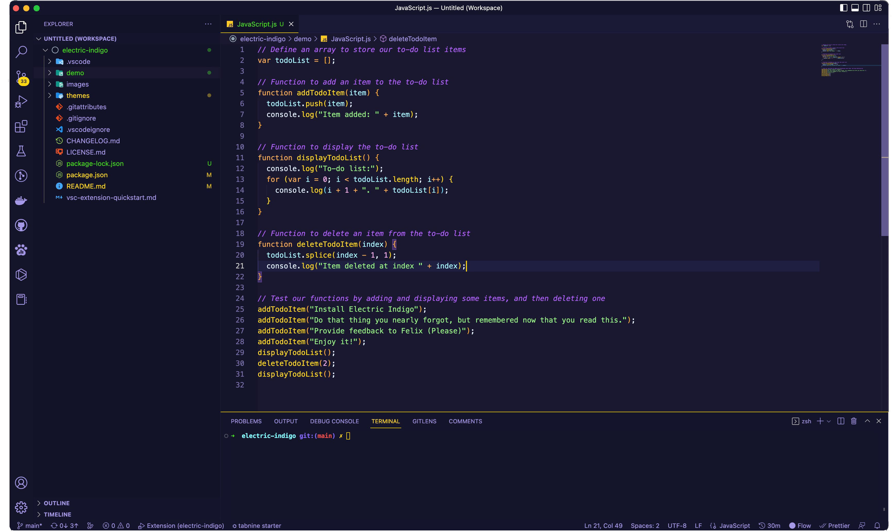
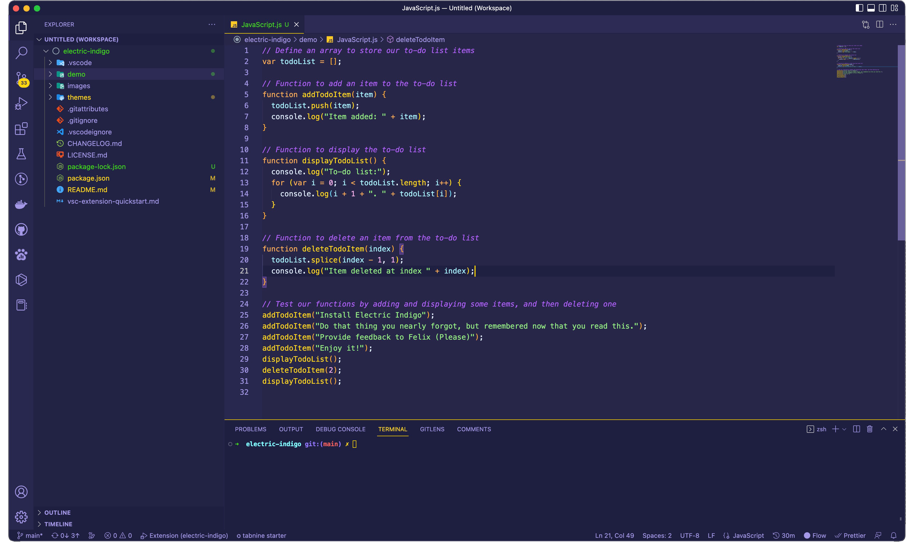

# Electric Indigo

*Let your code come to life with vibrant colors and awesome contrast.*<br>
This theme offers great aesthetics while not sacrificing any functionality. 
<br>
> <i>Nothing is invented and perfected at the same time</i>. <br>
> Please provide your feedback, it'll be much appreciated - or just reach out and you might have a new friend!
<br>

I'll be adding better/more snapshots. But here are the two different themes.

### Electric Black - JavaScript

### Electric Indigo - JavaScript



```json
// Theme Setup. Pick one of the "workbench.colorTheme"
"workbench.colorTheme": "Electric Indigo",
// "workbench.colorTheme": "Electric Black",
"editor.fontFamily": "Menlo, Operator Mono, Monaco, 'Courier New', monospace",
/* Currently this theme only looks like it should by letting semanticHighlighting be set to true.
I will try and see if this can be changed: But as it look, this setting is needed to keep the 
correct colorazation for enums as it in some cases would be classified as a variable and be set
to blue instead of green. Have this to either true or "configuredByTheme" as below. */
"editor.semanticHighlighting.enabled": "configuredByTheme",
// Formatting Optional.
"editor.formatOnSave": true,
"prettier.eslintIntegration": true,
"eslint.run": "onType",
"editor.codeActionsOnSave": {
    "source.fixAll.eslint": true
}
```

## Features
- Visually soothing color scheme with a soft and vibrant color palette
- High contrast syntax highlighting
- Supports multiple programming languages
<br>
<br>
Created with inspiration from one and only Ahmad Awais and his <i>Shades of Purple</i>. <br>
But with a much softer color palette to make it last a lifetime. And a lot of other improvements/tweaks.