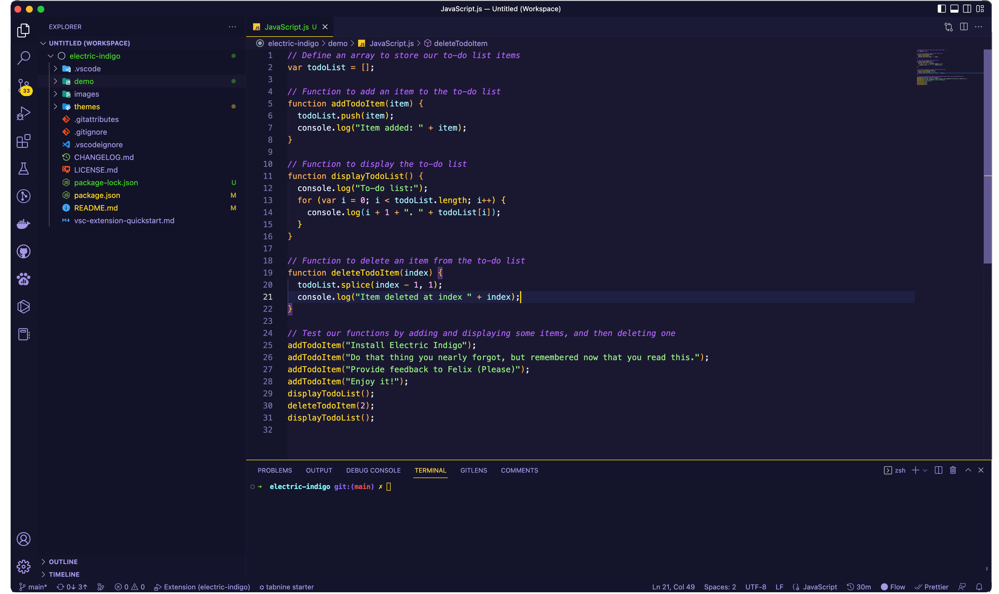
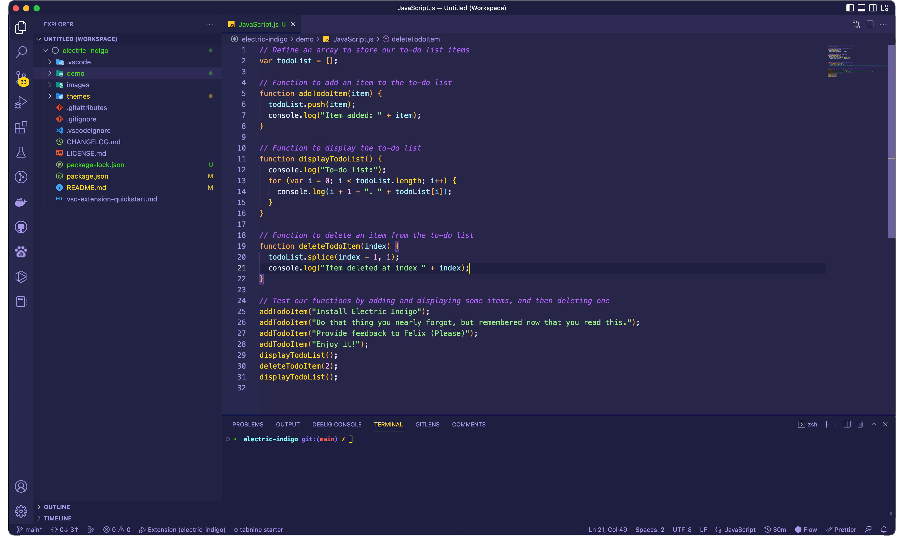
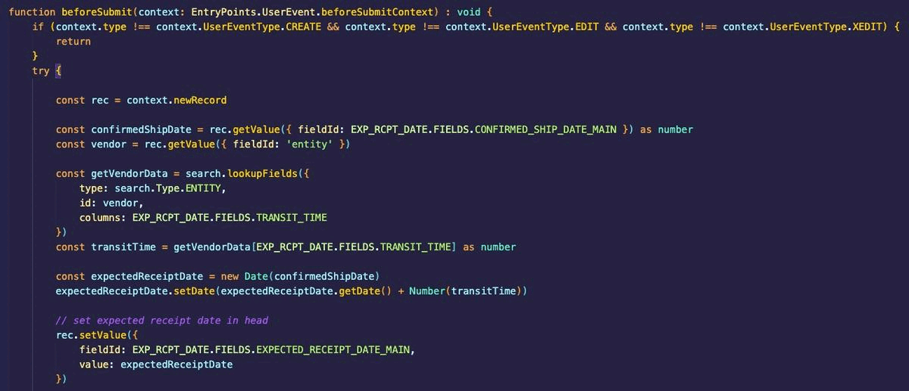

# Electric Indigo

*Let your code come to life with vibrant colors and awesome contrast.*

Electric Indigo is a pair of dark VS Code themes with a soft, vibrant palette and high-contrast syntax highlighting. They look great without sacrificing readability.

> *Nothing is invented and perfected at the same time.*
> Feedback is very welcome. Open an issue, or just reach out and you might have a new friend!

## Themes

### Electric Noctis

The main theme (formerly *Electric Black*): electric accents on a deep midnight background (`#191830`).



### Electric Indigo

The original: the same palette on a lighter, richer indigo background (`#282649`).



## Installation

**From VS Code**

1. Open the Extensions view (`⇧⌘X` / `Ctrl+Shift+X`).
2. Search for **Electric Indigo** and click **Install**.
3. Open the Command Palette (`⇧⌘P` / `Ctrl+Shift+P`), run **Preferences: Color Theme**, and pick **Electric Noctis** or **Electric Indigo**.

**From the command line**

```sh
code --install-extension felixdivall.electric-indigo
```

Or get it from the [Visual Studio Marketplace](https://marketplace.visualstudio.com/items?itemName=felixdivall.electric-indigo).

## Recommended settings

Add these to your `settings.json`:

```jsonc
{
  // Pick one
  "workbench.colorTheme": "Electric Noctis",
  // "workbench.colorTheme": "Electric Indigo",

  "editor.fontFamily": "Menlo, 'Operator Mono', Monaco, 'Courier New', monospace",

  // Both themes use semantic highlighting so that enums, enum members and
  // similar tokens get their own color instead of the generic variable blue.
  // "configuredByTheme" (the default) or true both work. Don't set it to false.
  "editor.semanticHighlighting.enabled": "configuredByTheme"
}
```

> **Upgrading from Electric Black?** The theme has been renamed. Change
> `"workbench.colorTheme": "Electric Black"` to `"Electric Noctis"`.

## Features

- Soft, vibrant color palette that's easy on the eyes during long sessions
- High-contrast syntax highlighting
- Tuned for JavaScript, TypeScript, HTML, CSS, Python, Ruby, C#, Markdown and more
- Semantic highlighting support for richer, more accurate colors

## Inspiration

Created with inspiration from the one and only Ahmad Awais and his *Shades of Purple*, but with a much softer palette made to last a lifetime, plus a lot of other improvements and tweaks.



## Contributing

Spotted a token that looks off, or a language that could use some love? [Open an issue or a pull request](https://github.com/felixdivall/electric-indigo).

## License

[MIT](LICENSE.md) © Felix Divall
